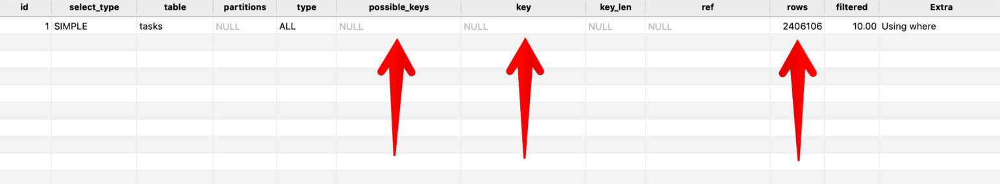

### 1. Database index là gì ? 
- PK luôn có index tự động
- đánh index như là đánh mục lục => dễ tìm tài liệu hơn
### 2. Trình bày vấn đề
- relation ship đơn giản user có nhiều task
- tưởng tượng user có ~2.4M task
	```
	$user = User::find(1);
	$tasks = $user->tasks()->get();
	```
- web sẽ không tải được do hết bộ nhớ
- đoạn code trên được laravel gen ra câu query:
	```
	SELECT * FROM `tasks` WHERE `tasks`.`user_id` = 1 AND `tasks`.`user_id` IS NOT NULL
	```
- thử `Explain` câu truy vấn này
-  
- quan tâm tới `possible_keys` và `key`: cho biết index nào có sẵn và index nào được sử dụng.
- `rows` cho chúng ta biết bao nhiêu bản ghi được quét câu query
- kết quả: không index nào được sử dụng và phải quét qua 2.4M records
### 3. Đánh chỉ mục
```
Schema::table('tasks', function (Blueprint $table) {
	$table->index('user_id');
});
```
- Lưu ý: nếu có nhiều mệnh đề `where` trong câu query thì có thể đánh một index cho nhiều cột = **compound index**
- EX:
	```
	SELECT * FROM `tasks` WHERE `tasks`.`user_id` = 1 AND `tasks`.`created_at` >= '2020-23-08 17:02:00'
	```
	có thể đánh một **compound index** như sau: 
	```
	Schema::table('tasks', function (Blueprint $table) {
		$table->index(['user_id', 'created_at']);
	});
	```
- ***Warning***:
	+ Thêm nhiều index sẽ tăng kích cỡ CSDL và RAM sử dụng cho CSDL
	+ thứ tự các trường trong **compound index** có thể tác động đến kết quả. thông thường sắp xếp chỉ mục được sử dụng từ nhiều nhất đến ít nhất.

